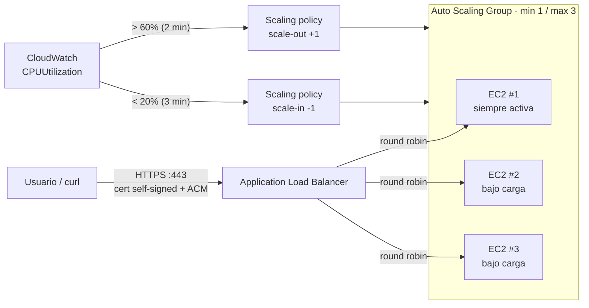

# AWS High Availability Environment (Lab03)

Laboratorio de **Sistemas Distribuidos**: un Application Load Balancer de AWS reparte tráfico entre un grupo de **Auto Scaling** que crece hasta 3 instancias EC2 cuando el CPU sube, y se encoge solo hasta 1 cuando el CPU vuelve a estar bajo — con HTTPS en el ALB usando un certificado SSL gratuito (self-signed, importado a ACM). Todo se despliega con Terraform sobre una cuenta de **AWS Academy Learner Lab**.

Es la continuación de [`aws-load-balancing-lab`](https://github.com/stephy0410/aws-load-balancing-lab) (Lab02): ahí el número de instancias era fijo (2); aquí un Auto Scaling Group decide cuántas instancias existen en cada momento.

## Arquitectura



## Qué hace cada pieza

| Pieza | Recurso Terraform | Qué hace |
|---|---|---|
| **ALB** | `aws_lb`, `aws_lb_listener` (80→301 a 443, 443 HTTPS) | Recibe el tráfico y lo reparte round robin entre las instancias vivas. |
| **Target group + health check** | `aws_lb_target_group` | Marca una instancia sana/enferma pegándole a `/health` cada 15s; el ASG usa este mismo chequeo (`health_check_type = "ELB"`). |
| **Launch template** | `aws_launch_template` | Plantilla de cada instancia nueva: AMI Amazon Linux 2023, `user_data.sh` (Node.js + app + `stress-ng`), IMDSv2 obligatorio, disco cifrado. |
| **Auto Scaling Group** | `aws_autoscaling_group` | `min_size=1`, `max_size=3`, `desired_capacity=1`. Registra/desregistra instancias del target group automáticamente. |
| **Scaling policies + alarmas** | `aws_autoscaling_policy`, `aws_cloudwatch_metric_alarm` | CPU promedio del grupo > 60% dos minutos → +1 instancia. CPU < 20% tres minutos → −1 instancia. Elástico: siempre vuelve a 1. |
| **Security Groups** | `aws_security_group` | El ALB acepta 80/443 de todo internet; las EC2 solo aceptan HTTP del ALB y SSH de una IP fija. |
| **Cert self-signed + ACM** | `tls_private_key`, `tls_self_signed_cert`, `aws_acm_certificate` | Certificado SSL **gratuito** para el listener HTTPS del ALB. Válido criptográficamente, pero sin autoridad pública (AWS Academy no permite Route53 con dominio propio para validación DNS), así que el navegador lo marca "no seguro" — esperado, `curl -k`. |

## Estructura del repo

```
main.tf         # Security groups, cert self-signed + ACM, launch template, ALB, ASG, scaling policies + alarmas
variables.tf    # Parámetros configurables (tamaño de instancia, min/max, thresholds de CPU, CIDR de SSH...)
outputs.tf      # URLs, comandos listos para copiar (listar instancias, probar carga, verificar round robin)
providers.tf    # Configuración del provider de AWS
versions.tf     # Versiones de providers + backend remoto (S3) del state
user_data.sh    # Script que arranca en cada EC2 nueva: instala Node.js + stress-ng y levanta la app
```

## Cómo desplegarlo

Requisitos: una cuenta de **AWS Academy Learner Lab** ([módulo 186884](https://awsacademy.instructure.com)) y Terraform ≥ 1.11.

```bash
# 1. Credenciales de AWS Academy en ~/.aws/credentials, perfil [academy]
#    (copiadas desde "AWS Details" -> "AWS CLI" en el Learner Lab)

# 2. Ajusta el backend S3 en versions.tf si no usas el bucket "stephanie.borrego"

terraform init
terraform apply
```

Al terminar, `terraform output web_url` da la URL HTTPS del load balancer.

## Cómo probar la elasticidad

1. Confirma que arrancó con 1 sola instancia:
   ```bash
   $(terraform output -raw list_current_instances_cmd)
   ```
2. Genera carga de CPU por SSH en esa instancia (usa su IP pública del comando anterior):
   ```bash
   ssh -i ~/.ssh/id_ed25519 ec2-user@<ip> 'stress-ng --cpu $(nproc) --timeout 300s'
   ```
3. Espera ~2-4 minutos y vuelve a correr `list_current_instances_cmd`: deberías ver hasta 3 instancias `InService`.
4. Verifica el round robin entre las instancias nuevas:
   ```bash
   for i in $(seq 1 10); do curl -sk https://$(terraform output -raw alb_dns_name)/api/whoami; echo; done
   ```
5. Deja que `stress-ng` termine (o mátalo) y espera; sin carga, cada ~3 minutos el ASG quita una instancia hasta volver a quedarse con **solo 1** (`min_size`).

## Trade-offs reconocidos

- El certificado del ALB es self-signed: cripto real, pero sin autoridad pública, porque este Learner Lab no tiene un dominio propio para validar por DNS con ACM/Route53. En un entorno productivo real, iría un dominio propio + ACM con validación DNS.
- Las políticas de escalado suman/restan **una instancia a la vez** (no saltan directo a 3 ni a 1), con cooldowns de 2-3 minutos — así se evita "flapping" ante picos momentáneos de CPU.
- AWS Academy Learner Lab expira sesiones y borra recursos al reiniciarse el lab; el state remoto en S3 permite retomar sin perder el tracking de Terraform, pero los recursos de AWS igual desaparecen si la sesión termina.
